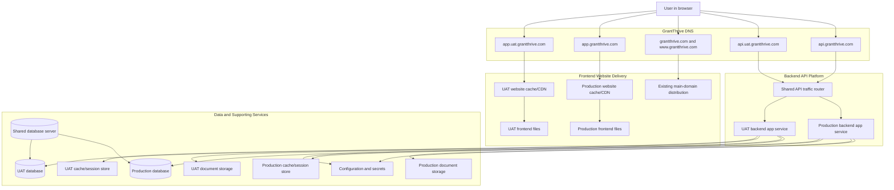

# GrantThrive Architecture Overview

This document explains what has been built for GrantThrive, how the parts connect, and why the main design decisions were made. It is written for readers who do not need to know AWS terminology.

## Executive Summary

GrantThrive now has two working environments:

- **UAT**: A test/staging environment used to validate changes before production.
- **Production**: The live customer-facing environment.

Both environments have separate frontend websites and backend application services, so deploying or testing one environment does not overwrite the other.

To reduce cost and simplify operations, the environments share two large infrastructure components:

- **Shared load balancer**: The entry point that routes API traffic to the right backend service.
- **Shared database server**: One database server with separate logical databases for UAT and Production.

The main marketing domain `grantthrive.com` remains separate and is not managed by the new app frontend stack.

## Environment Overview

| Purpose | UAT | Production |
|---------|-----|------------|
| Frontend app URL | `https://app.uat.grantthrive.com` | `https://app.grantthrive.com` |
| Backend API URL | `https://api.uat.grantthrive.com` | `https://api.grantthrive.com` |
| Frontend storage bucket | `uat.grantthrive.com-frontend` | `prod.grantthrive.com-frontend` |
| Backend service | `granthrive-uat-uat` | `granthrive-prod-prod` |
| Database | `granthrive_uat` | `granthrive` |
| Document storage | `grantthrive-documents-uat` | `grantthrive-documents-prod` |
| Container image tag | `uat-latest` | `prod-latest` |

## Component Diagram



## How the Pieces Work Together

### 1. User Opens the Web App

When a user visits:

- `app.uat.grantthrive.com`, they get the UAT frontend.
- `app.grantthrive.com`, they get the Production frontend.

The frontend is a set of static files: HTML, JavaScript, CSS, images, and PDFs. These files are stored in separate buckets for each environment and delivered through a fast global cache.

This means frontend deployments are simple:

1. Build the frontend app.
2. Upload the built files to the correct environment bucket.
3. Clear the website cache so users see the latest version.

### 2. Frontend Calls the Backend API

The frontend talks to the backend API:

- UAT frontend calls `api.uat.grantthrive.com`.
- Production frontend calls `api.grantthrive.com`.

The backend has CORS configured. In plain terms, this means the backend only accepts browser requests from the approved frontend domains.

Current approved frontend origins:

- `https://app.uat.grantthrive.com`
- `https://app.grantthrive.com`

### 3. API Traffic Is Routed to the Correct Backend

Both API domains go through one shared API traffic router. That router looks at the requested hostname:

- Requests for `api.uat.grantthrive.com` go to the UAT backend service.
- Requests for `api.grantthrive.com` go to the Production backend service.

This lets UAT and Production share one public API entry point while still keeping the actual backend services separate.

### 4. Backend Uses Separate Data Per Environment

UAT and Production use the same database server, but each has its own database inside it:

- UAT database: `granthrive_uat`
- Production database: `granthrive`

This keeps UAT data separate from live Production data while avoiding the cost of running two separate database servers.

Other supporting resources remain separate:

- UAT and Production have separate backend services.
- UAT and Production have separate cache/session stores.
- UAT and Production have separate document storage buckets.
- UAT and Production have separate app secrets/configuration.

## What Has Been Built

### Frontend

Built:

- UAT frontend site at `app.uat.grantthrive.com`
- Production frontend site at `app.grantthrive.com`
- Separate storage buckets for frontend files
- Separate website cache/distribution layers for app frontends
- DNS records for both app domains
- Deployment script for frontend build, upload, and cache invalidation

Important boundary:

- The main domain `grantthrive.com` and `www.grantthrive.com` remain on the existing main-domain distribution.
- The app frontend stack manages only `app.uat.grantthrive.com` and `app.grantthrive.com`.

### Backend

Built:

- UAT backend API at `api.uat.grantthrive.com`
- Production backend API at `api.grantthrive.com`
- Separate backend app services for UAT and Production
- Container image repositories for backend deployments
- Shared API router/load balancer
- Shared database server with separate databases
- Separate Redis cache/session stores
- Separate document storage buckets
- Secure configuration storage for app secrets
- Deployment script for image build, database bootstrap, migrations, and service rollout

### State Management

Built:

- Separate remote Terraform state bucket for backend infrastructure
- Separate remote Terraform state bucket for frontend infrastructure
- Shared lock table to prevent two Terraform changes running at the same time
- State-management repo `.gitignore` to keep local Terraform caches, state files, plan files, and local variable files out of Git

This matters because Terraform state is the record of what infrastructure exists. Keeping it centralized means another developer can clone the repo, initialize Terraform, and continue managing the same cloud resources safely.

Commit boundary:

- Commit Terraform source files, documentation, and `.terraform.lock.hcl`.
- Do not commit `.terraform/`, local state files, plan output, crash logs, override files, or local `.tfvars` files.
- Remote state is stored in AWS S3, not in Git.

## Key Design Decisions and Why They Were Made

### Separate UAT and Production Frontend Buckets

Decision:

- Use `uat.grantthrive.com-frontend` for UAT.
- Use `prod.grantthrive.com-frontend` for Production.

Why:

- Prevents accidental overwrite of Production frontend files while testing UAT.
- Makes it easy to confirm which environment has which files.
- Avoids confusion with the existing main `grantthrive.com` site.

### Keep `grantthrive.com` Separate From the App Frontend

Decision:

- Do not move or delete the existing main-domain distribution.
- Serve the app at `app.grantthrive.com`.

Why:

- Protects the existing main website.
- Avoids DNS and certificate conflicts.
- Keeps the app and marketing/main website cleanly separated.

### Shared Database Server, Separate Databases

Decision:

- Use one database server.
- Create separate UAT and Production databases inside it.

Why:

- Reduces infrastructure cost.
- Keeps UAT and Production data logically separated.
- Keeps the option open to split Production into its own database server later.

Tradeoff:

- The database server is shared, so a major database-level outage affects both environments.
- For a larger production workload, Production can be moved to its own database server.

### Shared API Router / Load Balancer

Decision:

- Use one API traffic router for both UAT and Production.
- Route traffic by hostname.

Why:

- Reduces cost.
- Keeps public API routing simple.
- Supports both `api.uat.grantthrive.com` and `api.grantthrive.com` cleanly.

Tradeoff:

- UAT owns this shared router. Production depends on the UAT-owned shared infrastructure being present.

### Separate Backend App Services

Decision:

- Keep UAT and Production backend services separate.

Why:

- UAT deployments do not replace Production backend containers.
- Production can scale independently from UAT.
- Failures in one app service do not directly stop the other app service.

### Deployment Script Runs Database Migrations

Decision:

- Backend deployment now creates the logical database if missing and runs `flask db upgrade`.

Why:

- A fresh database can exist but still lack tables/columns.
- Health checks can pass with basic database connectivity while registration fails without migrations.
- Running migrations during deploy makes fresh environment setup repeatable.

## Deployment Flow

### Branch-Based CI/CD

Active GitHub Actions workflows are now used for application deployment:

| Branch | Environment | What happens |
|--------|-------------|--------------|
| `staging` | UAT | Terraform apply, application deploy, and health checks |
| `prod` | Production | Terraform apply, application deploy, and health checks |

The `main` branch is not used as the automatic Production deployment branch. This keeps normal mainline development separate from the explicit Production release branch.

### Infrastructure Deployment

State management should be available first.

Then deploy in this order:

1. Backend UAT infrastructure
2. Backend Production infrastructure
3. Frontend UAT infrastructure
4. Frontend Production infrastructure

Backend UAT goes first because it owns shared infrastructure used by Production.

### Application Deployment

Backend:

1. Build backend image.
2. Push image to the environment repository.
3. Ensure database exists.
4. Run database migrations.
5. Restart backend service.
6. Wait for the service to become healthy.

Frontend:

1. Build frontend app using the right environment mode.
2. Upload files to the environment frontend bucket.
3. Clear the website cache.
4. Validate the app URL returns `200`.

## Current Validation Checks

Frontend:

```bash
curl -I https://app.uat.grantthrive.com
curl -I https://app.grantthrive.com
```

Backend:

```bash
curl -i https://api.uat.grantthrive.com/api/health
curl -i https://api.grantthrive.com/api/health
```

CORS:

```bash
curl -i -H 'Origin: https://app.uat.grantthrive.com' https://api.uat.grantthrive.com/api/health
curl -i -H 'Origin: https://app.grantthrive.com' https://api.grantthrive.com/api/health
```

Expected backend health response:

```json
{"database":"ok","domain":"grantthrive.com","service":"grantthrive-backend","status":"ok"}
```

## Future Scaling Paths

### 1. Move Production to Its Own Database Server

When Production traffic or compliance requirements increase, Production can be moved from the shared database server to a dedicated Production database server.

Benefits:

- Stronger isolation from UAT.
- Easier production-specific backup and restore strategy.
- Better performance control.

### 2. Use Separate API Routers for UAT and Production

Production can be moved to its own API router/load balancer.

Benefits:

- Stronger environment isolation.
- UAT changes cannot affect Production routing.
- Easier production-specific security and monitoring.

### 3. Increase Backend Service Capacity

Both backend services currently run with a small task count. As usage grows, Production can run multiple backend tasks.

Benefits:

- More request capacity.
- Better availability during deployments.
- Better resilience if one task becomes unhealthy.

### 4. Add More CI/CD Safety Gates

Basic branch-based CI/CD is now active. The next improvement is to add stronger safety gates before Production changes are applied.

Recommended additions:

1. Run automated tests before deployment.
2. Produce a Terraform plan artifact before apply.
3. Require manual approval for Production apply.
4. Run smoke tests after backend and frontend deploy.
5. Notify the team when UAT or Production deployment completes.

### 5. Improve Health Checks

Current health checks confirm database connectivity. Future health checks can validate more application-critical items:

- Required database tables exist.
- Redis/cache is reachable.
- Document storage bucket is accessible.
- Required secrets are present.

This would catch schema/setup issues earlier.

### 6. Add Monitoring and Alerts

Recommended future alerts:

- Backend service unhealthy
- API returns repeated 5xx errors
- Database CPU/storage threshold crossed
- Frontend bucket is empty after deploy
- Website delivery layer serving high error rates

## Plain-English Glossary

| Term | Meaning |
|------|---------|
| Frontend | The web app users see in their browser |
| Backend/API | The server-side application that handles login, registration, grants, documents, and data |
| Database | Where application records are stored |
| Cache/session store | Fast temporary storage used by the backend |
| Bucket | Cloud storage folder for files |
| CDN/cache | Global website delivery layer that makes frontend files load faster |
| DNS | The system that maps domain names to the right service |
| Terraform | Tool used to define and recreate cloud infrastructure from code |
| Terraform state | Terraform's record of what cloud resources it manages |
| Migration | A database schema update, such as creating or changing tables |
